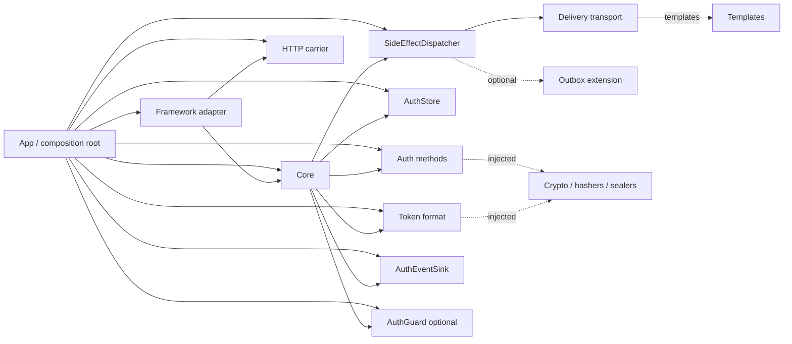
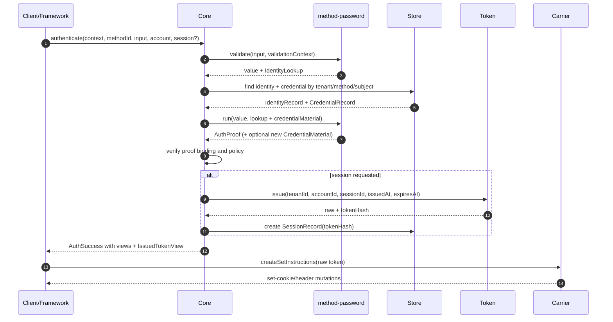
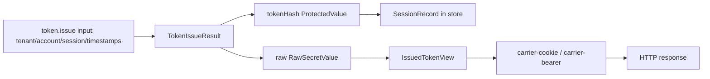
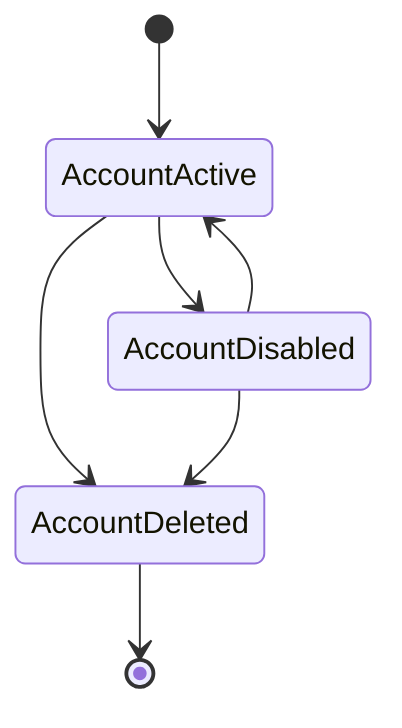
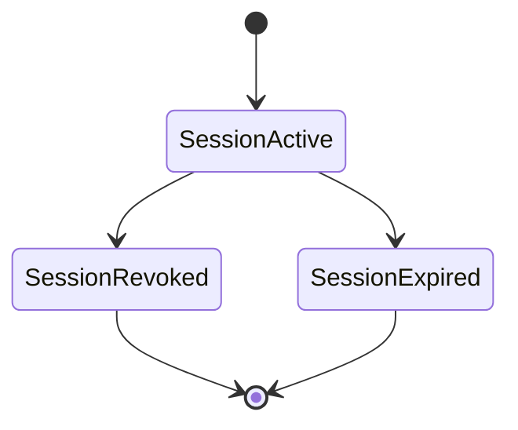
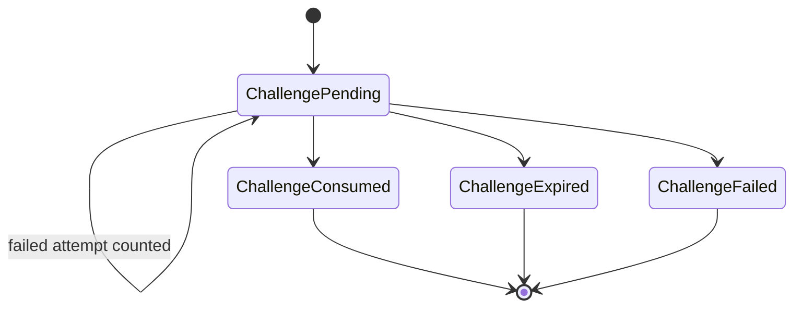

# 07 — Diagrams and visual tables

This document is a visual companion to the normative contracts and flow matrices. If a diagram conflicts with `spec/contracts/*.d.ts` or `docs/02-FLOWS.md`, the contracts and flow matrices win.

## System role map



## Dependency direction

```mermaid
flowchart TB
  Contracts[@authmodules/contracts]
  Core[@authmodules/core]
  Method[@authmodules/method-*]
  Store[@authmodules/store-*]
  Token[@authmodules/token-*]
  Carrier[@authmodules/carrier-*]
  Delivery[@authmodules/delivery-*]
  Effects[@authmodules/effects-*]
  Framework[@authmodules/framework-*]
  App[Application]

  Core --> Contracts
  Method --> Contracts
  Store --> Contracts
  Token --> Contracts
  Carrier --> Contracts
  Delivery --> Contracts
  Effects --> Contracts
  Framework --> Contracts
  Framework --> Core
  Framework --> Carrier
  App --> Core
  App --> Method
  App --> Store
  App --> Token
  App --> Carrier
  App --> Delivery
  App --> Effects
  App --> Framework
```

Rules:

| Package family | May depend on | Must not depend on |
|---|---|---|
| `core` | contracts | concrete methods, stores, carriers, frameworks, delivery implementations |
| `method-*` | contracts, injected crypto/helpers | core, store, framework, token |
| `store-*` | contracts | core, method, framework |
| `token-*` | contracts, injected crypto | core, carrier, store |
| `carrier-*` | contracts | core, token, store |
| `framework-*` | core public API, carrier contract | store, method internals, password/OTP verification |
| `effects-*` | effects/delivery contracts, optional outbox extension | core decisions, method proof logic |

## Password authenticate sequence



## OTP challenge sequence

```mermaid
sequenceDiagram
  autonumber
  participant UI as Client/Framework
  participant Core
  participant Method as method-otp
  participant Store
  participant Effects
  participant Delivery

  UI->>Core: begin(context, methodId, input, account, session?)
  Core->>Method: validate(input, validationContext)
  Method-->>Core: value + optional IdentityLookup
  Core->>Core: account preflight + guard/policy
  Core->>Core: generate challengeId
  Core->>Method: begin.run(value, challengeId + lookup)
  Method-->>Core: ChallengeMaterial + expiresAt + maxAttempts + delivery effect
  Core->>Store: create ChallengeRecord(binding + material)
  Core->>Effects: dispatch(delivery effect, SideEffectContext)
  Effects->>Delivery: send(template/data, DeliveryContext)
  Core-->>UI: challengeId + expiresAt

  UI->>Core: complete(context, challengeId, input)
  Core->>Store: find ChallengeRecord by tenant + challengeId
  Core->>Core: precheck pending/expiry/attempts
  Core->>Method: complete.validate(input, validationContext)
  Core->>Core: stored lookup wins; validate lookup binding
  Core->>Method: complete.run(value, challengeMaterial + lookup)
  alt wrong OTP counts as attempt
    Method-->>Core: MethodFailure(countsAsAttempt=true)
    Core->>Store: recordFailedAttempt(expectedVersion)
    Store-->>Core: RecordFailedAttemptResult
    Core-->>UI: challenge failed
  else proof succeeds
    Method-->>Core: AuthProof
    Core->>Store: consumePending(expectedVersion)
    Core->>Core: resolve account + maybe create session
    Core-->>UI: AuthSuccess
  end
```

## Session/token split



Important split:

| Internal | Public |
|---|---|
| `TokenIssueResult.raw` | `IssuedTokenView.raw` |
| `TokenIssueResult.tokenHash` | never returned by core |
| `SessionRecord.tokenHash` | never returned by core |
| core-owned `issuedAt/expiresAt` | `IssuedTokenView.issuedAt/expiresAt` |

## Store record lifecycle







## Account resolution decision table

| Mode | Existing identity missing | Existing identity belongs to actor | Existing identity belongs to another account |
|---|---|---|---|
| `create-new-account` | create account + identity | conflict | conflict |
| `require-existing-identity` | login/challenge failure | use linked account | use linked account |
| `create-account-if-identity-missing` | create account + identity | use linked account | use linked account |
| `link-to-actor-account` | create identity linked to actor | success/idempotent | conflict |

Notes:

```text
link-to-actor-account requires AuthContext.actor.type === 'account'.
require-existing-identity must not leak account existence in login-like flows.
```

## Side-effect dispatch model

```mermaid
flowchart TD
  Method[Method returns SideEffectRequest[]]
  Core[Core]
  Dispatcher[SideEffectDispatcher]
  Required{Any required effect failed?}
  BestEffort{Only best-effort failed?}
  Delivery[DeliveryTransport]
  Outbox[effects-outbox extension]
  Success[Auth operation may succeed]
  Failure[Auth operation fails safely]

  Method --> Core
  Core --> Dispatcher
  Dispatcher --> Delivery
  Dispatcher -. optional .-> Outbox
  Dispatcher --> Required
  Required -- yes --> Failure
  Required -- no --> BestEffort
  BestEffort -- yes: ok=true + failed[] --> Success
  BestEffort -- no --> Success
```

## getSession semantics

```mermaid
flowchart TD
  Start[getSession(context, token?)]
  Missing{token missing?}
  Identify[token.identify(raw, expectedTenantId)]
  Invalid{invalid / mismatch / not found / expired / revoked?}
  Infra{store/token infrastructure failure?}
  Null[ok=true, value=null]
  Session[ok=true, SessionView]
  Error[ok=false, safe AuthFailure]

  Start --> Missing
  Missing -- yes --> Null
  Missing -- no --> Identify
  Identify --> Infra
  Infra -- yes --> Error
  Infra -- no --> Invalid
  Invalid -- yes --> Null
  Invalid -- no --> Session
```

## Contract surface and reference composition

| Stable contract surface | Reference production composition |
|---|---|
| `guard.d.ts` is a stable optional hook | `guard-memory` when in-process rate limiting is appropriate |
| `outbox.d.ts` is exported through `extensions.d.ts` | OTP uses effects-outbox + outbox worker |
| synchronous dispatcher contract remains supported | sync delivery only where no auth-state atomicity is required |
| identity-first credential model | future credential-first lookup |
| cookie carrier | bearer carrier roadmap |
| opaque token | JWT token roadmap |

The stable surface stays small while the official OTP production composition chooses durable delivery without changing core operations.

## Core collaborator quick reference

| Collaborator | Required for baseline? | Core asks it to | Core must not assume |
|---|---:|---|---|
| `AuthStore` | yes | persist/find auth records | why a user should be authenticated |
| `AuthMethod` | yes | validate input, produce material/proof/challenge effects | account/session ownership |
| `TokenFormat` | yes | issue/identify token material | cookie/header transport |
| `SideEffectDispatcher` | only when required effects occur | dispatch or defer delivery effects | auth decisions or proof validity |
| `CorePolicy` | no | allow/deny decision points | storage or side-effect behavior |
| `AuthGuard` | no | rate-limit/lockout style decisions | account resolution policy |
| `AuthEventSink` | no | best-effort observability | required audit semantics |
| `HttpTokenCarrier` | framework-level | read/write token via HTTP mutations | token verification or sessions |

## Operation-to-store touchpoints

| Operation | Durable store | Session store | Challenge store |
|---|---|---|---|
| `enroll` | create account/identity/credential | create only if proof + session request | no |
| `authenticate` | find identity/credential, maybe replace credential material | create only if session request | no |
| `begin` | optional account preflight | no | create challenge |
| `complete` | resolve/create/link account if proof succeeds | create from challenge binding when requested | find, precheck, consume or record counted failure |
| `getSession` | no | find active session by token identity/hash | no |
| `revokeSession` | no | idempotent revoke/non-enumerating lookup | no |

## Secret type quick reference

| Type | Runtime purpose | Persistence rule | Serialization rule |
|---|---|---|---|
| `RawSecretValue` | password input, OTP, raw token | never persist | `toJSON()` returns redacted value |
| `ProtectedValue` | password hash, OTP verifier, token hash | persist only via explicit `revealForPersistence()` | `toJSON()` returns redacted value |
| `SealedSecretValue` | encrypted outbox/durable secret payload | may persist ciphertext via explicit reveal | `toJSON()` returns redacted value |
| `PublicData` | safe extension data | may persist/log if app considers it safe | plain JSON |

## Minimal baseline package set

| Package | Role |
|---|---|
| `@authmodules/contracts` | normative TypeScript contracts |
| `@authmodules/core` | orchestration and public API |
| `@authmodules/testkit` | deterministic doubles and compliance suites |
| `@authmodules/method-password` | password enroll/authenticate method |
| `@authmodules/method-otp` | OTP challenge method |
| `@authmodules/store-postgres` | Baseline durable/session/challenge store adapter |
| `@authmodules/crypto-node` | Node crypto/hash/seal implementation |
| `@authmodules/token-opaque` | opaque token format |
| `@authmodules/carrier-cookie` | HTTP cookie carrier |
| `@authmodules/delivery-email-smtp` | email SMTP delivery transport |
| `@authmodules/effects-outbox` | transactional delivery outbox dispatcher |
| `@authmodules/outbox-worker` | lease-aware durable delivery worker |
| `@authmodules/framework-express` | Express adapter |
